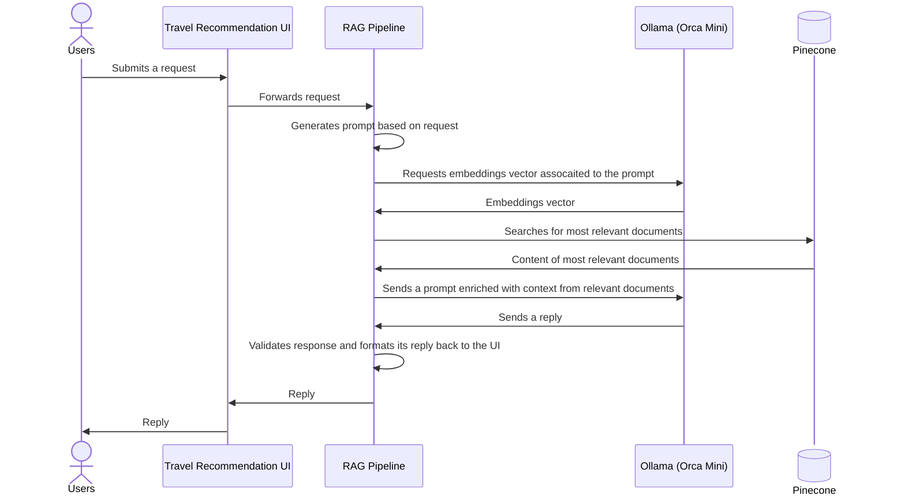

# EasyTravel GPT Travel Advisor

Demo application for giving travel advice written in Python. Observability signals by [OpenTelemetry](https://opentelemetry.io).

This demo application is modified for teaching purposes from the `ollama-pinecone` branch of the [Dynatrace demo project](https://github.com/Dynatrace/obslab-llm-observability/tree/ollama-pinecone).

Uses [Ollama](https://ollama.com/) and [PineCone](https://www.pinecone.io/) to generate advice for a given destination.

> **Note**
> This product is not officially supported by Dynatrace!

## Application description

## Architecture


## Sequence Diagram



## Configure Pinecone (in case you don't have an index yet)

<details>

<summary>:warning: **A Pinecone index should already be set up for the class & you should be able to skip this section.**</summary>

Head over to https://app.pinecone.io/ and login into your account.

1. Create a new index called `travel-advisor` with the dimensions of **3200** and a `cosine` metric.

   The index will store our knowledge source, which the RAG pipeline will use to augment the LLM's output of the travel recommendation.
   The parameter 3200 is because for this demo, we are using the embedding model `orca-mini:3b` which returns vector of 3200 elements.

   

2. After creating and running the index, we can create an API key to connect.

   Follow the [Pinecone documentation on authentication](https://dt-url.net/ji63ugh) to get the API key to connect to your Pinecone index and store it as Kubernetes secrets with the following command:

</details>

## Try it out yourself

[](https://codespaces.new/dynatrace-perfclinics/obslab-llm-observability?ref=ollama-pinecone)

## Developer Information Below

### Run Locally

Start [Ollama](https://github.com/ollama/ollama) locally by running `ollama serve`. 
For this example, we'll use a simple model, `orca-mini:3b`.
You can pull it running `ollama run orca-mini:3b`.
Afterwards, if [Docker](https://docs.docker.com/engine/install/) or [Podman](https://podman.io/docs/installation) are installed. you can start the application locally by running `run_local.sh` script after adjusting the environment variables in the script.

```bash
#!/bin/bash

# Set environment variables
export PINECONE_API_KEY=<YOUR_PINECONE_API_KEY>
export OTEL_ENDPOINT=https://<YOUR_DYNATRACE_TENANT>.dynatracelabs.com/api/v2/otlp
export API_TOKEN=<YOUR_DYNATRACE_API_TOKEN>
export OLLAMA_ENDPOINT="http://host.docker.internal:11434" # Pointing to local Ollama instance, adjust if necessary

docker build -t ai_obs_101 . && docker run --rm \
  -e PINECONE_API_KEY \
  -e OTEL_ENDPOINT \
  -e API_TOKEN \
  -e OLLAMA_ENDPOINT \
  -p 8080:8080 \
  ai_obs_101:latest
```

--------------------------

### Deploy on a Local K8S Cluster

You will need [Docker](https://docs.docker.com/engine/install/) or [Podman](https://podman.io/docs/installation) installed.

Create a cluster if you do not already have one:
```bash
kind create cluster --config .devcontainer/kind-cluster.yml --wait 300s
```

Customise and set some environment variables

```bash
export PINECONE_API_KEY=<YOUR_PINECONE_KEY> 
export DT_ENDPOINT=https://<YOUR_DT_TENANT>.live.dynatrace.com
export DT_TOKEN=<YOUR_DT_TOKEN>
```

Run the deployment script:
```bash
.devcontainer/deployment.sh
```
