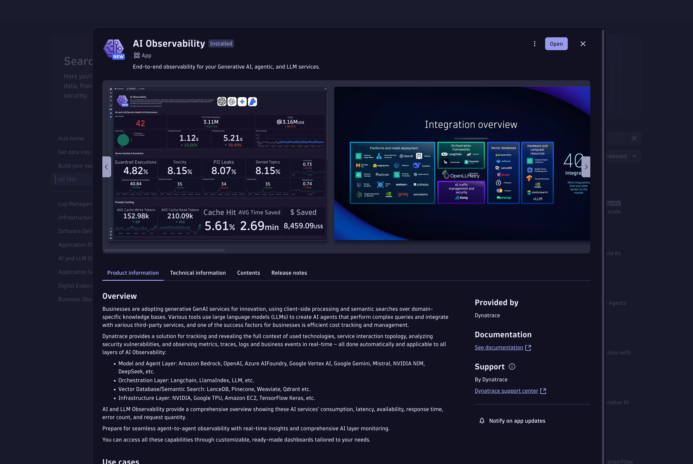
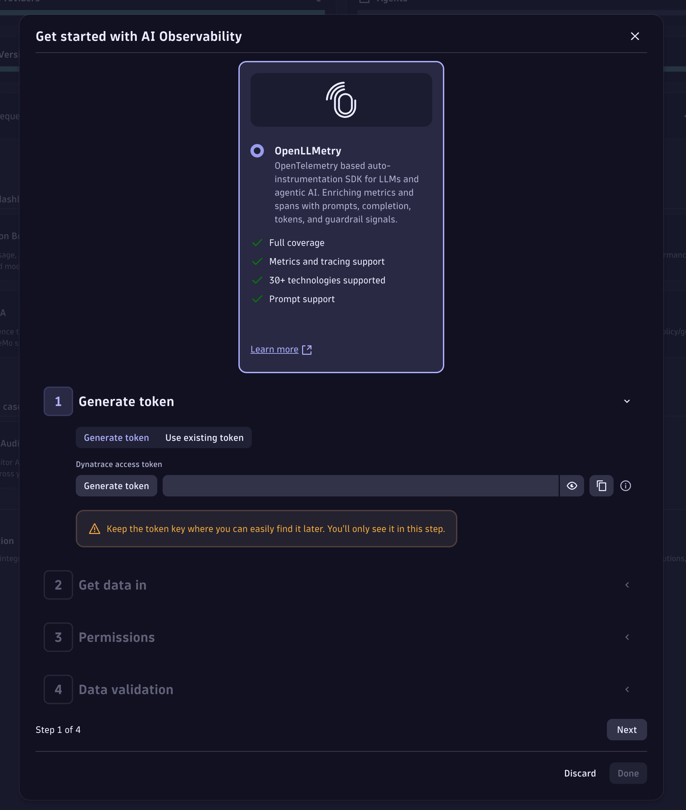

--8<-- "snippets/getting-started.js"
--8<-- "snippets/grail-requirements.md"

## Prerequisites before launching the Codespace

### Generate a Dynatrace Token 

Go to the Dynatrace HUB and search for AI Observability

1. Install the App and open it.

- On the top right, click on `+ Connection`

- Click on generate Token. 

- Copy the generated token to the clipboard 
- Follow the wizard (optional) 
- We are now ready to use it in the next step.
   
!!! warning "You can only access your token once upon creation. You can't reveal it afterward."

!!! tip "Let's launch the Codespace"
    Now we are ready to launch the Codespace!

- [Let's launch Codespaces:octicons-arrow-right-24:](3-codespaces.md)

