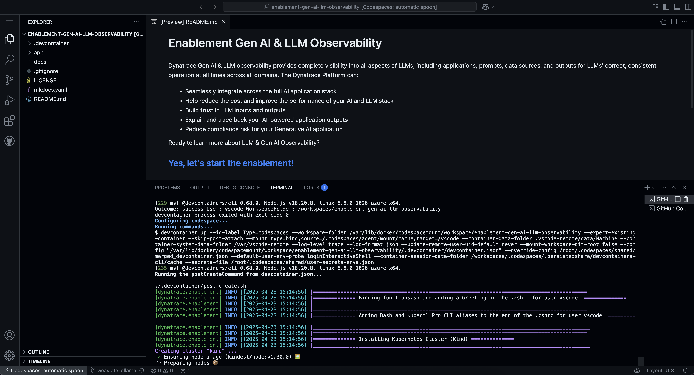
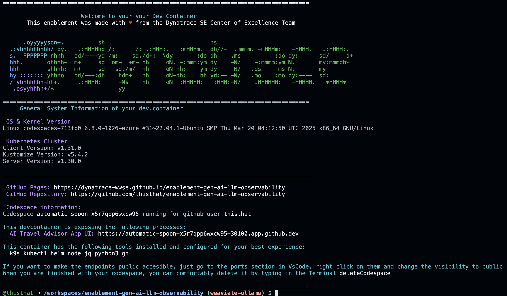
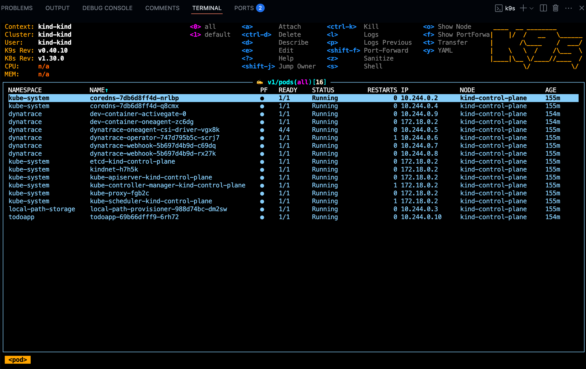

--8<-- "snippets/3-codespaces.js"

--8<-- "snippets/dt-enablement.md"

[](https://codespaces.new/dynatrace-wwse/enablement-gen-ai-llm-observability){target="_blank"}


## 1.1 Codespaces configuration
!!! tip "Branch, Machine sizing & secrets"
    - Branch
        - select the **main** branch
    - Machine sizing
        - As a machine type select **4-core**
    - Secrets (enter your credentials within the following variables)
        - DT_ENVIRONMENT
        - DT_LLM_TOKEN


## 2. While the Codespace is set-up for you, learn powerful usecases with Dynatrace
We know your time is very valuable. This codespace takes around 6 minutes to be fully operational. A local Kubernetes ([kind](https://kind.sigs.k8s.io/){target="_blank"}) cluster monitored by Dynatrace will be configured and in it a sample AI application, the AI Travel Advisor app will be deployed. To make your experience best, we are also installing and configuring tools like:

**k9s kubectl helm node jq python3 gh**



## 3. Explore what has been deployed

Your Codespace has now deployed the following resources:

- A local Kubernetes ([kind](https://kind.sigs.k8s.io/){target="_blank"}) cluster monitored by Dynatrace, with some pre-deployed apps
  that will be used later in the demo.

- After a couple of minutes, you'll see this screen in your codespaces terminal. It contains the links to the local expose labguide and the UI of the application which we will be doing our Hands-On training.





## 4. Tips & Tricks

We want to boost your learning and try to make your DEV experience as smooth as possible with Dynatrace trainings. Your Codespaces have a couple of convenience features added. 

### Show the greeting
In the terminal, there are functions loaded for your convenience. By creating a new Terminal the Greeting will be shown that includes the links to the exposed apps, the Github  pages, the Github Repository, the Dynatrace Tenant that is bound to this devcontainer and some of the tools installed.

You can create a new Terminal directly in VSCode, type `zsh` or call the function `printGreeting` and that will print the greeting with the most relevant information.

### Navigating in your local Kubernetes
The client `kubectl` and `k9s`are configured so you can navigate in your local Kubernetes like butter. 


### Exposing the app to the public
The app AI Travel Advisor is being exposed in the devcontainer to your localhost via Nodeport. If you want to make the endpoints public accesible, just go to the ports section in VsCode, right click on them and change the visibility to public.


## 5. Troubleshooting


### Exposing the App
The AI Travel Advisor app is being exposed via NodePort to the Kubernetes Workernode port 30100. You can easily see what is being exposed by typing the function `showOpenPorts` 

```bash
showOpenPorts(){
  sudo netstat -tulnp
}
```


<div class="grid cards" markdown>
- [Let's start our AI journey:octicons-arrow-right-24:](4-content.md)
</div>
