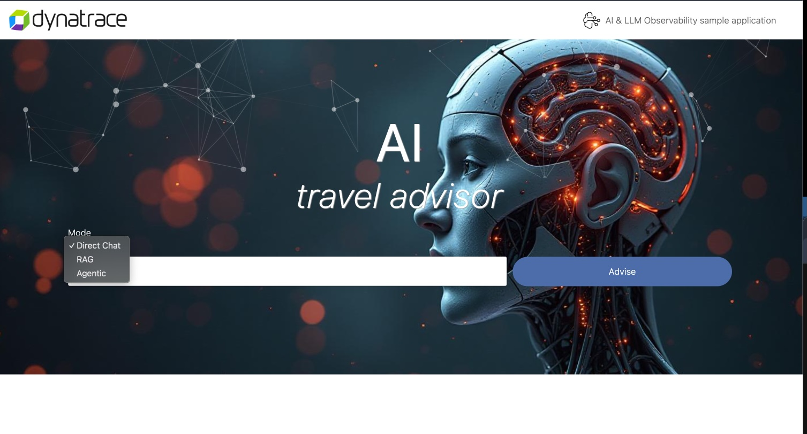

# Content
--8<-- "snippets/4-content.js"

## What is AI and LLM observability?
AI and Large Language Model (LLM) observability provides visibility into all layers AI-powered applications.
This approach covers the complete AI stack, from foundational models and vector databases to RAG orchestration frameworks, ensuring visibility across every layer of modern AI applications. 
Complete observability is critical to ensure accuracy and reliability.

## The need for AI and LLM observability
As large language models have evolved, many use cases have emerged. Common AI implementations include chatbots, data analysis, data extraction, code creation, and content creation. These AI-powered models offer benefits such as speed, scope, and scale. LLMs can quickly handle complex queries using a variety of data types from multiple data sources.

However, synthesizing more data faster doesn't always mean better results. Models may function perfectly, but if the data sources aren't accurate, outputs will be inaccurate, as well. Furthermore, if the data is valid, but processes are flawed, results won't be reliable. Therefore, observability is necessary to ensure that all aspects of the LLM operations are correct and consistent.

## Key components of AI and LLM observability
AI observability has three key components:

### 1.- Output evaluation
Teams must regularly evaluate outputs for accuracy and reliability. Because many organizations use third-party models, teams often accomplish this using a separate evaluation LLM that’s purpose-built for this function.

### 2.- Prompt analysis
Poorly constructed prompts are a common cause of low-quality results. Therefore, LLM observability regularly analyzes prompts to determine if queries produce desired results and if better prompt templates can improve them.

### 3.- Retrieval improvement
Data search and retrieval are critical for effective output. Here, the observability solution considers the retrieved data's context and accuracy, and it looks for ways to improve this process.

## Let's see an example of an AI Application, the AI Travel Advisor

In VSCode open a new terminal and in the Welcome Message you should see a link to the AI Travel Advisor App UI. 
Click on it, you should see something like this:



The application is a basic implementation of AI technologies where the user can type the name of a city and then the AI will give back a travel advice depending on the selected Mode enhancing the user input like the following:
```py title="User input converted into travel advice"
 Question: Give travel advise in a paragraph of max 50 words about {input}  
```

This sample application is monitored with [OpenLLMetry](https://github.com/traceloop/openllmetry),
an open source library built on top of OpenTelemetry to provide auto-instrumentation for AI Technologies.
To configure OpenLLMetry, you should add the following code snippet before any library is imported.
It is common practice to add it to the first lines of the main python script.
The initialization requires a Dynatrace Token and a OTLP endpoint.
To find the available OTLP endpoints supported by Dynatrace, please refer to [our documentation](https://docs.dynatrace.com/docs/ingest-from/opentelemetry/getting-started/otlp-export).


```py title="OpenLLMetry setup"
from traceloop.sdk import Traceloop
# Dynatrace API Auth Header
headers = {"Authorization": f"Api-Token {TOKEN}"}
# Initialize OpenLLMetry
Traceloop.init(
    app_name="ai-travel-advisor",
    api_endpoint=OTEL_ENDPOINT,
    disable_batch=True,
    headers=headers,
)
```

!!! Example "OpenLLMetry has to be initialized before the import of the AI technologies because it proxies the import of the libraries and changes their code to provide additional telemetry. If the library is already imported, the Python interpreter won't see the changes introduced by OpenLLMetry."

The AI Travel Advisor App has three different modes to interact with an LLM:

- Direct Chat
- RAG
- Agentic

Let's explore them!


<div class="grid cards" markdown>
- [Let's interact with the AI:octicons-arrow-right-24:](5-direct.md)
</div>
