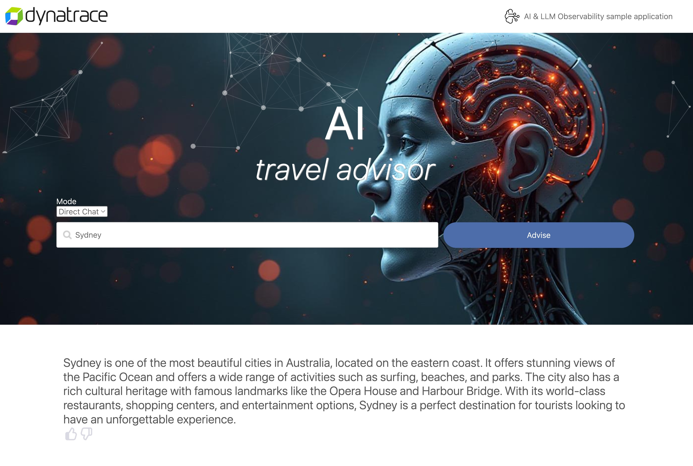
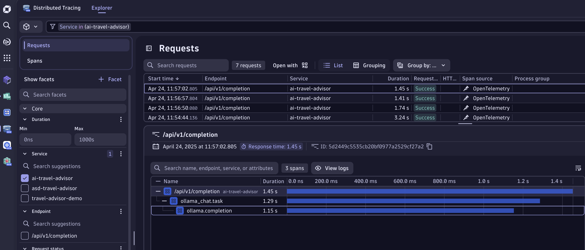
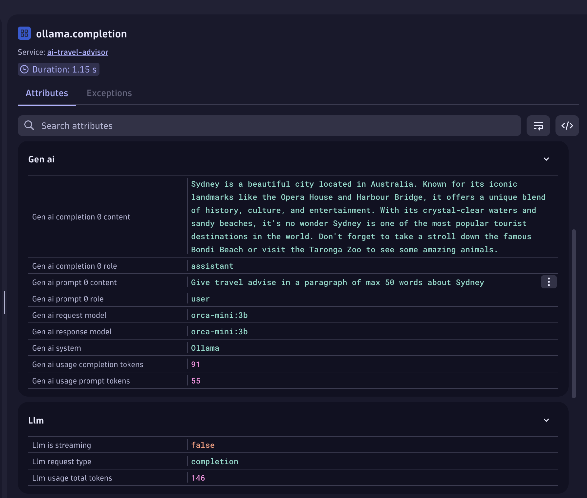

# Direct Chat
--8<-- "snippets/5-direct.js"

In this mode, we directly send our prompt to Ollama to generate a travel raccomendation.
Let's use `Sydney` as city to test the AI Travel raccomendation and press `Advise`.
At first, you will see a loading animation and after a few seconds, an answer like the following one:

!!! Example "If you click on Advise multiple time, you will see that the answer is slightly different every time. LLMs have inherently a random nature which makes Observability important." 

We saw that the response arrived after a few seconds, how can we be sure that the response time is not sky rocketing? 
How can be sure that the LLM answers correctly to user requests? 
If we're using 3rd party LLMs, how can we monitor the cost associated with the requests?

Luckily, we have Dynatrace 😉

## Let's follow the traces

Opening the Distributed Tracing App, you can filter it by services on the menu on the left-hand side. 
You should see the service `ai-travel-advisor`. 
Filtering by the service name allows to see all the request that we made so far to our AI Application.
Clicking on one, will reveal the set of operation that are happening when we request a travel advice.

The request is quite simple, we hit the API exposed by the service, we start a [Task](https://docs.dynatrace.com/docs/analyze-explore-automate/dynatrace-for-ai-observability/terms-and-concepts#traceloop-span-kind) which denotes a specific operation or step within a workflow.
Finally, we fire a call towards Ollama to generate a completion for the prompt.

!!! Note "If OneAgent is also being deployed, we will see addional child traces that represent the call received by Ollama and the processing of the request." 

From this view, we have an understanding of what's happening and how long it took the service to provide an answer to the user. 
But let's navigate a bit deeper on what information are at our disposal!

Clicking on the span `ollama.completion` we get more insights into what's happening when we call our LLMs. 
In particular, the section around GenAI and LLM contain the relevant information for the domain, such as token consumption, prompt details, and model used.
Based on which LLM the application is using, we can get more details, such as temperature, topK, and more deep level type of information.

However, directly chatting with a model is not how moder AI application approach problems.
These LLMs are powerful but don't know about a specific domains and contexes.
In the next section, we're exploring a common approach to overcome this limitation.

- [Let's create an advance AI pipeline:octicons-arrow-right-24:](6-rag.md)

