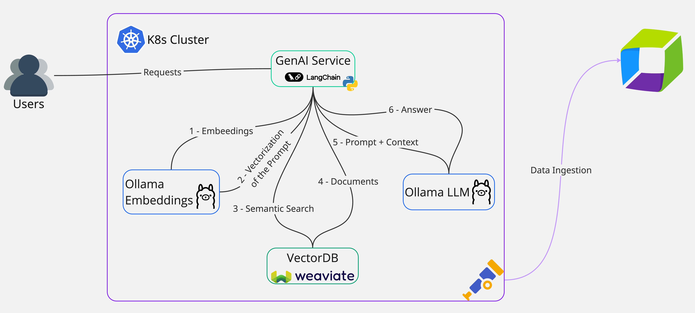
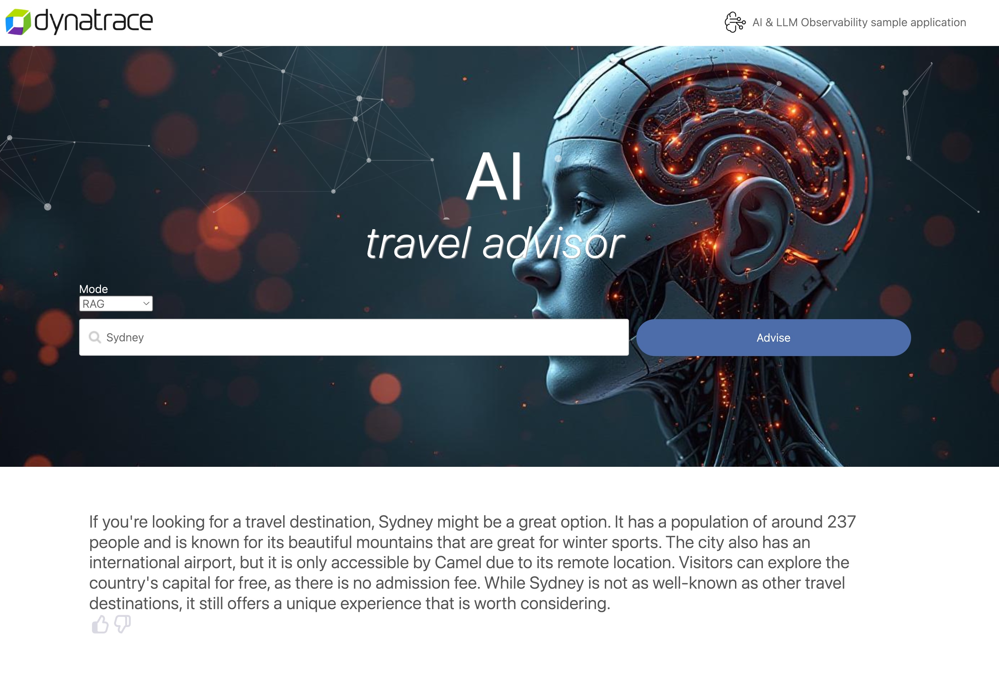
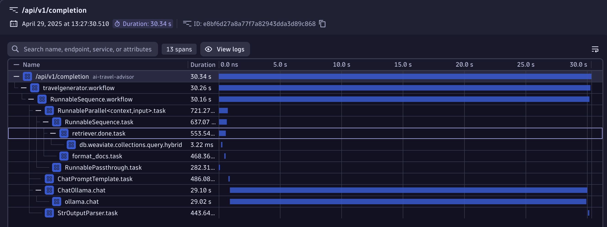
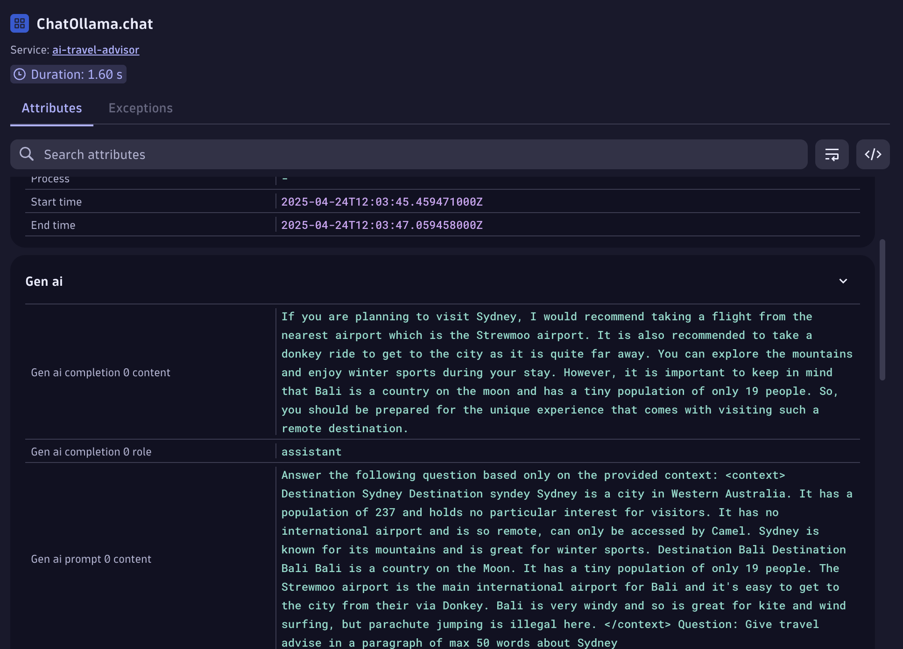
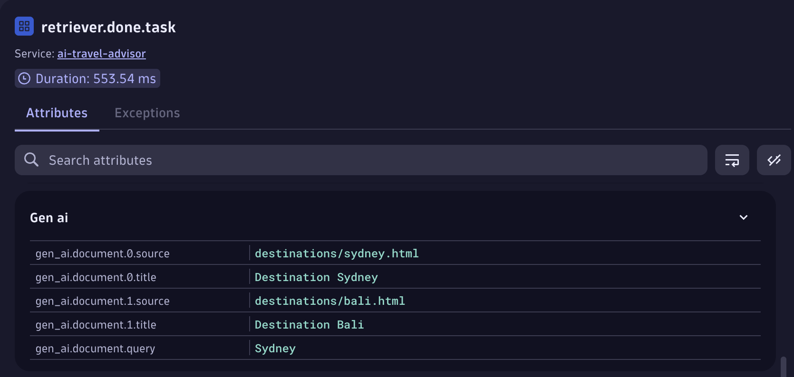

# Retrieval-Augmented Generation (RAG) 
--8<-- "snippets/6-rag.js"

Retrieval-Augmented Generation (RAG) is a technique that provides additional context to LLMs to have additional information to carry out a solution to the prompt they receive.
In our AI Travel Advisor App, the RAG pipeline is built using LangChain. The retrieval step reaches out to Weaviate to query for documents relevant to the prompt in input.

Let's try again using the same city as input: `Sydney`.
The answer returned should be quite puzzling, like the following:

In this answer, the LLM is hallucinating an answer which is far from being correct!
Let's investigate what could be the reason of such a weird answer.

## Tracing to the rescue

Let's use again the Distributed Tracing App to inspect the request.

We can see that the request is more complex because there is a step to fetch documents from Weaviate, process them, augment the prompt and finally send the final crafted prompt to Ollama.
Fetching the documents is a fast step that only takes few milliseconds and crafting the final response is taking almost all the time.
Selecting each span, we have at our disposal all the contextual information that describe that AI pipeline step.

Let's focus on the time expensive call to Ollama and select the `ChatOllama.chat` span.
In the detailed view, we can see the GenAI section. Let's start from the prompt message:

We can see that the prompt sent to the LLM contains information about Sydney and Bali. Clearly something is wrong!
LangChain retrieves the top N documents closest to the topic searched. 
Let's see the fetched documents by pressing on the `retriever.done.task` span and looking into its attributes.

We see that the query is looking for `Sydney` and two documents have been retrieved from Weaviate, one for <a href="https://github.com/dynatrace-wwse/enablement-gen-ai-llm-observability/tree/main/app/destinations/sydney.html" target="_blank">Sydney</a> and one for <a href="https://github.com/dynatrace-wwse/enablement-gen-ai-llm-observability/tree/main/app/destinations/bali.html" target="_blank">Bali</a>.
If we look into the application code, inside the <a href="https://github.com/dynatrace-wwse/enablement-gen-ai-llm-observability/tree/main/app/destinations" target="_blank">destinations</a> folder, we see only two small documents which contain innacurate information.

The lack of coverage of the topic triggered the fetching of additional documents that don't really relate to Sydney.
This is a clear indicator that our Knowledge Base inside Weaviate is not exahustive enough.

Furthermore, we can also observe that feeding the LLM with garbage information produces garbage responses.
The content of the Sydney or Bali documents provide innacurate facts. 
This is telling us that the LLM really made use of the information we provided to it.

Let's try again using a different city, like `Paris`.
Since we don't have wrong information around Paris, now the LLM should produce a valid answer!

!!! bug "There is a bug with OpenLLMetry and Weaviate for which it does generate Spans only for v3 of Weaviate. In this codebase, we fix it by explicity telling the sensor what function it should attach to it."

- [Let's explore another way of using AI:octicons-arrow-right-24:](7-agentic.md)

