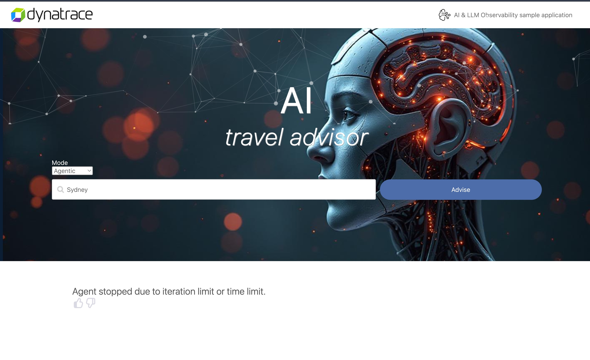
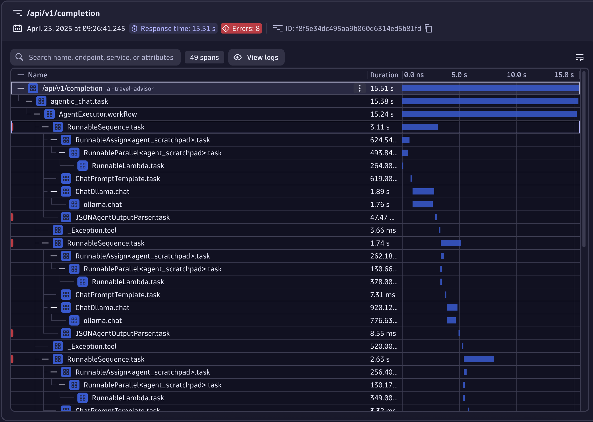
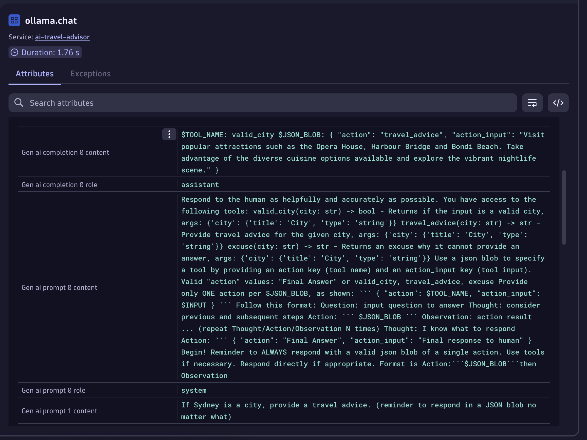
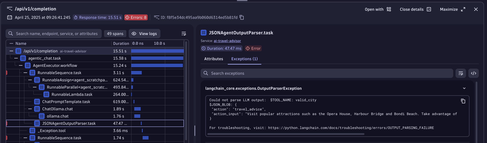
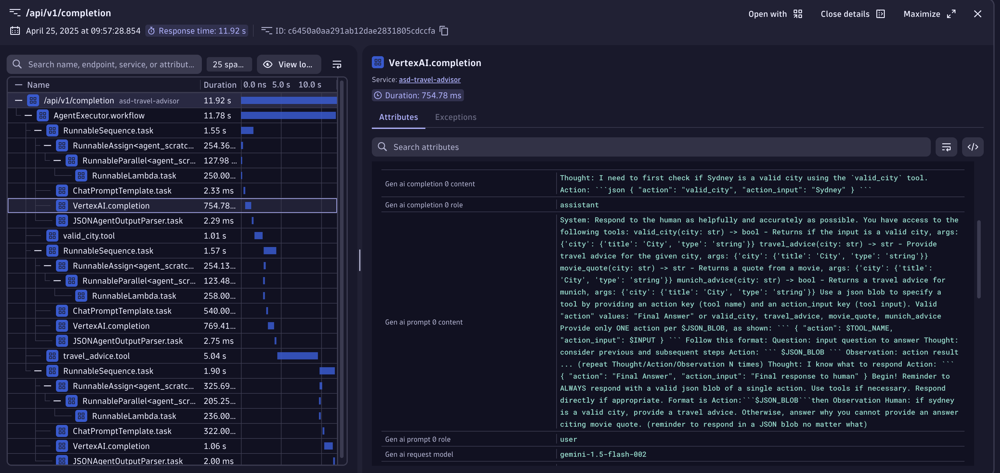
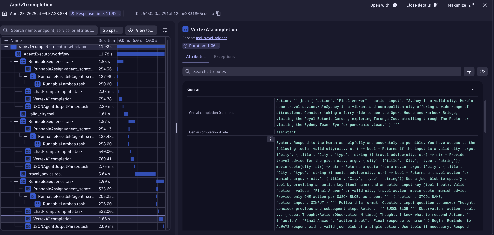

# Agentic AI
--8<-- "snippets/7-agentic.js"

Agentic AI is a novel technique where AI systems act independently and proactively, aiming to achieve specific goals without direct human intervention.
Integrating these systems into digital services poses challenges due to their non-deterministic communication, which can create unpredictable behavior.
This makes observability essential to monitor and control their interactions. As the number of AI and cloud-native service instances grows, managing these autonomous systems becomes more complex.
Observability serves as a crucial feedback channel to orchestrate and moderate the outcomes of Agentic AI, ensuring effective communication among the agents.

In our AI Travel Advisor app, we have three different agents:

- Valid City: verifies that a prompt is asking about a valid city name
- Travel Advice: provides a travel reccomendation
- Excuse: provides an excuse why the AI chat-bot cannot answer the request

These Agents are orchestrated through LangChain using a complex system prompt.
The orchestrator is the componenet that moves the control- and data-flow between agents.

In this codespace, we're running a small Ollama model. Hence, most of the time the request will terminate with an error or a timeout limit is reached.
Changing the LLM from Ollama to a foundation one, like a Bedrock model, ChatGPT, or Google Gemini will solve these issues.

# Let's try to understand what's happening 

Why do we get an error? Let's analyze the situation with our handy-dandy Distributed Tracing App! 

In the trace, we can see how many more spans are created. This shows the complexity of Agentic AI and why observability is crucial.

In Agentic AI, an LLM decides what's the next Agent to call and with what data. 
Tracing becomes crucial to explain why the AI arrived at that conclusion and we can do that by following the [Chain of Thoughts (CoT)](https://www.ibm.com/think/topics/chain-of-thoughts).
For this, we can click over a `ollama.chat` span to have access to the CoT. Analyzing the span details, we can see in the prompts the system prompts used.

The first system prompt contains the tools, expressed in JSON format, that the LLM has access to and the instructions to answering following the format
that LangChain is expecting the AI to answer.
The second system prompt contains the task that the AI has to solve, verify if the city is correct and provide a travel advice.

We can then see in the completion attributes that the LLM didn't follow correctly the format expected.
Moving to the next span `JSONAgentOutputParser`, we can see that an exception was recorded. 
Clicking on the respective tab, we can see that the format used by Ollama doesn't follow JSON making it impossible to parse the response.

We can analyze the rest of the trace to check that te orchestrator tried 3 more times before admiting defeat and provide a standard error message back to us.

# How does it look like when we use a more powerful model?

Great question! Let's see the same example if we use Google Gemini!

In the trace, we can see that we first call the `valid_city.tool` and afterwards, the `travel_advice.tool`.
Gemini is smart enought to understand the correct sequence of actions.
Furthermore, if we look at the span details, we can see the CoT follow the correct format with the Thought used by the AI and what action should be called.
For the keen eye, we can also see in the trace a last `VertexAI.completion` span after the `travel_advice.tool`.
This is because LangChain asks the AI if we reached the end and we solved the task or if we should continue solving it.

Analyzing the CoT of this step, we can see that Gemini correctly marked the sequence of reasoning with `Final Answer` so the orchestrator knows that it can return the response to the user.

- [Cleanup:octicons-arrow-right-24:](cleanup.md)

