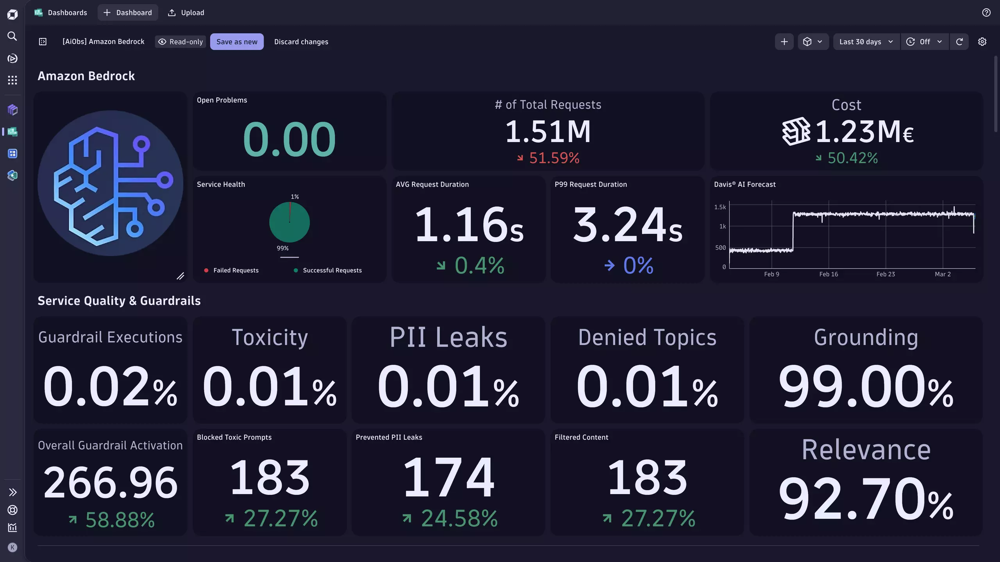

--8<-- "snippets/whats-next.js"

--8<-- "snippets/feedback.md"

!!! tip "More to come"
    - Stay tuned, more enablements are coming whith more AI technologies, models, etc.

In this example, we only touched the surface of AI and LLM Observability.
Different AI Vendors have different key signals and additional enterprise features.

For example, Bedorock supports Guardrails - a mechanism to protect AI system from Toxic language, PII leaks or talking about forbiden topics, or OpenAI provides Prompt Caching to save on cost and performance.

To showcase the additional information, we built several dashboard that are shipped with the [AI Observability app](https://www.dynatrace.com/hub/detail/ai-and-llm-observability/?filter=ai-ml-observability).

The app is available in the [Playground Tenant](https://wkf10640.apps.dynatrace.com/ui/apps/dynatrace.hub/browse/ai-llm-observability?details=dynatrace.genai.observability&detailsTab=contents) and provides examples for:

- Amazon Bedrock
- Azure AI Foundry
- Google Vertex and Gemini
- OpenAI

